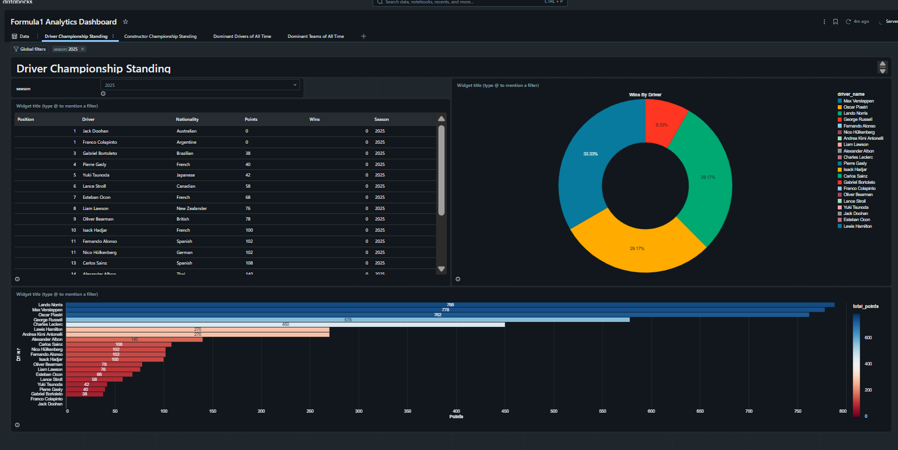
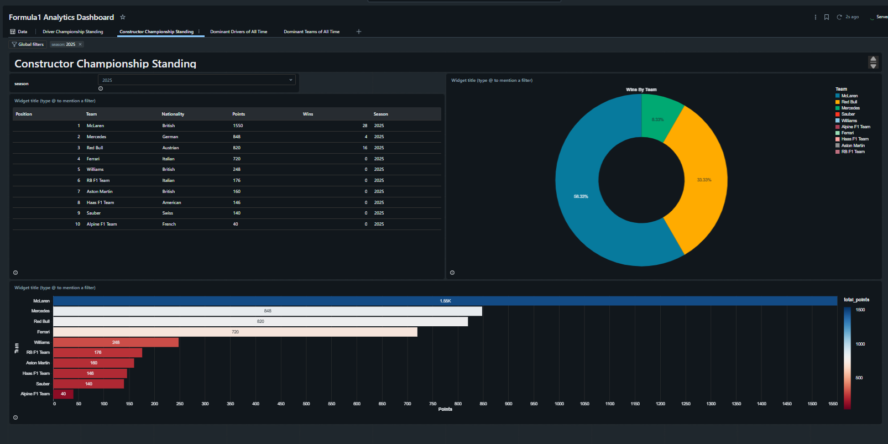
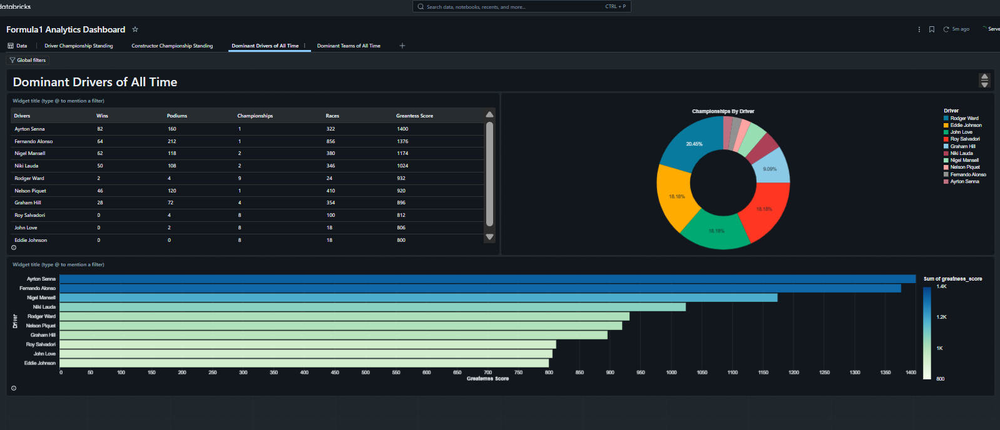
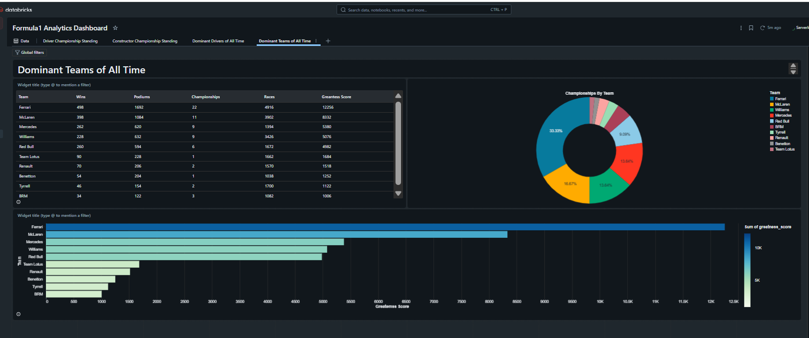
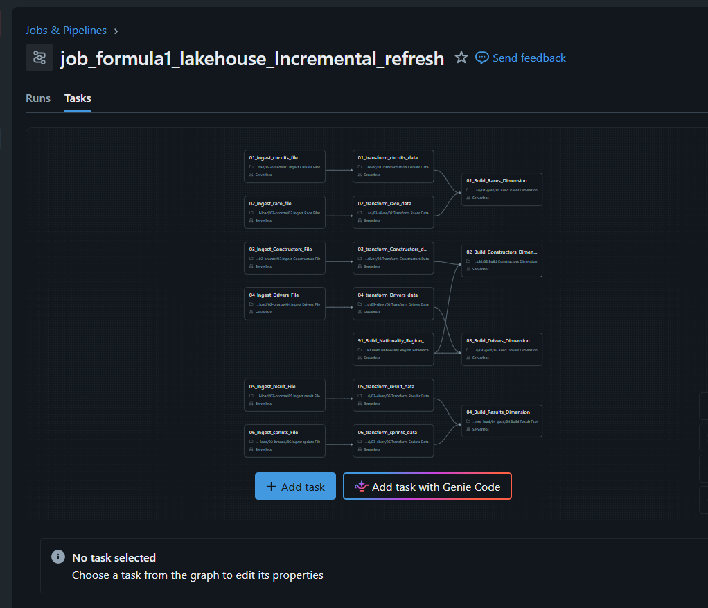
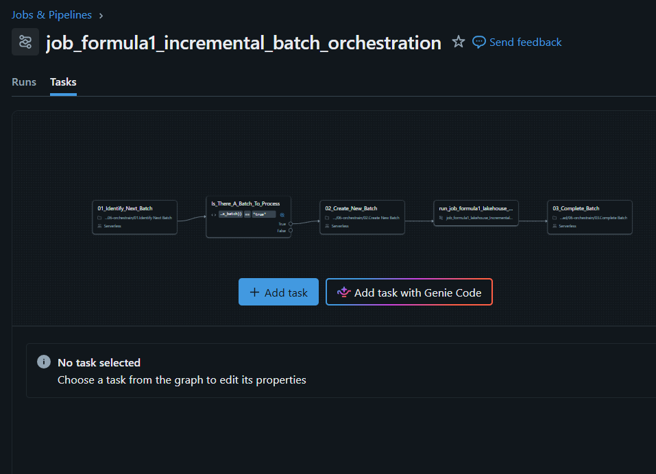
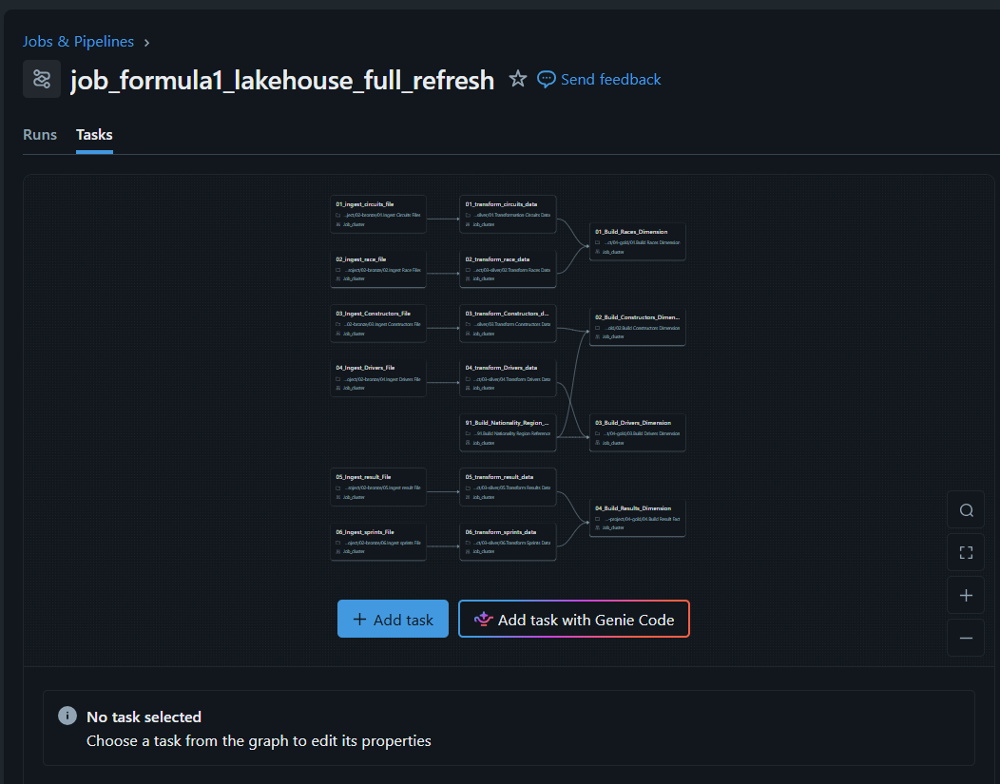

# Formula 1 Lakehouse on Azure Databricks

An end-to-end Lakehouse project built on **Azure Databricks + Unity Catalog**, using the **Medallion Architecture** (Landing → Bronze → Silver → Gold) to transform raw Formula 1 racing data into analytics-ready dimensional models — with two implementations: a **full refresh** pipeline and a **batch-driven incremental load** pipeline with job orchestration.

## Architecture

```
Landing (raw files) → Bronze (schema-enforced) → Silver (cleaned/standardised) → Gold (dimensional model) → Dashboard
                              Delta Lake tables, orchestrated by Databricks Jobs
```

- **Landing**: raw CSV/JSON source files, no transformations, controlled entry point (Unity Catalog external Volume)
- **Bronze**: schema enforced on read, ingestion metadata added (`source_file`, `ingestion_timestamp`), written as Delta tables
- **Silver**: cleaned, standardised column names (snake_case), duplicates removed, business-key validation, Delta tables
- **Gold**: dimensional model — fact and dimension tables, ready for BI/analytics
- **Orchestration**: Databricks Jobs handle dependencies, retries, and monitoring across the pipeline

## Cloud & Platform Setup

- **Azure Databricks workspace**: `databricks-course-ws` (resource group `databricks-course-rg`, region West US, Premium tier for role-based access control)
- **Identity**: dedicated Azure AD admin account for workspace administration, separate from the personal account
- **Unity Catalog governance**:
  - Metastore `metastore_azure_westus` (same region as the workspace), with a dedicated metastore admin
  - Access Connector for Databricks + Storage Blob Data Contributor role on the storage account
  - Storage Credential + External Location binding Unity Catalog to an ADLS Gen2 container
  - Catalog `formula1_incr` with `landing` / `bronze` / `silver` / `gold` schemas, each with its own managed storage location

## Project Structure

```
formla1-project/                     # Full-refresh version
├── 00-common/                       # Shared config + bronze write helpers
├── 01-setup/                        # Unity Catalog setup (external location, catalog, schemas, volume)
├── 02-bronze/                       # Ingestion notebooks (circuits, races, constructors, drivers, results, sprints)
├── 03-silver/                       # Cleansing & standardisation notebooks
├── 04-gold/                         # Dimension & fact builders (races, constructors, drivers, results, nationality reference)
└── 05-analytics/                    # Standings views and analysis notebooks

formla1-project-incremental-load/    # Incremental version
├── 00-common/                       # Adds silver/gold merge helpers (Delta MERGE upserts)
├── 06-orchestrain/                  # Batch control: identify next batch, create batch, mark complete
└── ... (same bronze/silver/gold/analytics structure, all batch_id-aware)
```

## Incremental Load Design

The incremental pipeline processes data in **batches**, tracked through a control table:

- `control.batch_control` (`batch_id`, `status`, `created_timestamp`, `updated_timestamp`) tracks batch state (`in_progress` / `completed`)
- **01. Identify Next Batch** — scans the landing folder, diffs against tracked batches, and passes the next unprocessed `batch_id` downstream via job task values
- **02. Create New Batch** — marks the batch `in_progress`
- Bronze/Silver/Gold notebooks all accept `p_batch_id` as a parameter and only process that batch's data
- Silver/Gold writes use **Delta `MERGE`** (upsert) instead of overwrite, guarded so a batch can never overwrite newer data on re-run
- **03. Complete Batch** — marks the batch `completed` once the run finishes successfully

This was orchestrated as three Databricks Jobs:
- `job_formula1_lakehouse_full_refresh` — full pipeline, one-shot
- `job_formula1_incremental_batch_orchestration` — loop that identifies and processes batches one at a time
- `job_formula1_lakehouse_incremental_refresh` — the actual bronze→silver→gold DAG run per batch

## Analytics Dashboard

Built a **Formula1 Analytics Dashboard** directly in Databricks with four pages:
- Driver Championship Standing (season filter, wins breakdown, points ranking)
- Constructor Championship Standing
- Dominant Drivers of All Time (wins, podiums, championships, races, "greatness score")
- Dominant Teams of All Time

## Tech Stack

Azure Databricks · Unity Catalog · Delta Lake (schema enforcement, `MERGE`, time travel) · PySpark · Spark SQL · Databricks Jobs (task orchestration, dependencies, batch control pattern) · Azure Data Lake Storage Gen2 · Azure AD

## Screenshots

**Analytics Dashboard**
| Driver Standings | Constructor Standings |
|---|---|
|  |  |

| Dominant Drivers of All Time | Dominant Teams of All Time |
|---|---|
|  |  |

**Pipeline Orchestration (Databricks Jobs)**
| Incremental Refresh DAG | Batch Orchestration DAG | Full Refresh DAG |
|---|---|---|
|  |  |  |

**Platform Setup**
- [Azure AD users](screenshots/01-azure-ad-users.png) — dedicated admin account
- [Databricks workspace](screenshots/02-databricks-workspace.png) — `databricks-course-ws`
- [Unity Catalog metastore](screenshots/03-metastore.png) — `metastore_azure_westus`
- [ADLS Gen2 containers](screenshots/10-adls-containers.png)
- [Azure resources overview](screenshots/09-azure-resources.png)
- [SQL Warehouses](screenshots/08-sql-warehouses.png)
- [Jobs list](screenshots/11-jobs-list.png)

## Key Learnings

- Designing and implementing a Medallion Architecture from raw files to a dimensional (facts & dimensions) gold layer
- Governing multi-layer storage access with Unity Catalog: Access Connectors, Storage Credentials, and External Locations
- Building idempotent, re-run-safe Delta `MERGE` upserts vs. simple overwrite writes
- Implementing a custom batch-tracking control table to drive incremental processing and orchestration
- Debugging real-world PySpark issues: silent `withColumnRenamed` failures, schema mismatches, and Unity Catalog SQL syntax errors
